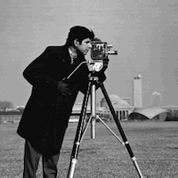
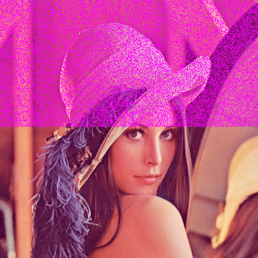

## Image Capsule
A simple proof of concept to show how to hide data into images.

### Algorithm
Image capsule uses even or odd numbers to determine if a bit is 1 or 0. First it takes the binary data of the source file and adds a header to it which defines how long the data is.

Then it converts the binary data into even or odd pixel numbers.

#### Enhancement
It would be also possible to use the color values R G B to store three times more data into an image.

### Example
For example I took the Lena image and inserted the camera man image into it.


*Lena Original*

```
Possible Data Length: 32764 bytes
```



*Camera Man*

```
Data Length: 16119 bytes
```

You can see the difference of the original image and the image which contains the data.



*Lena Difference*

### About
Written on a hacky evening!